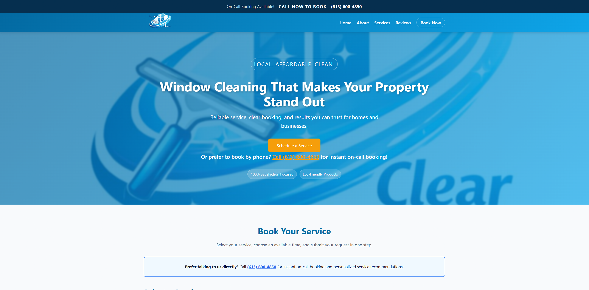
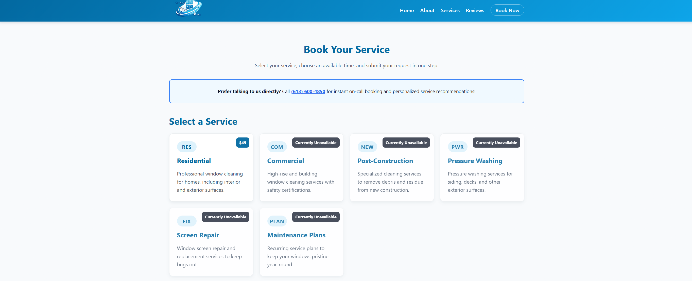
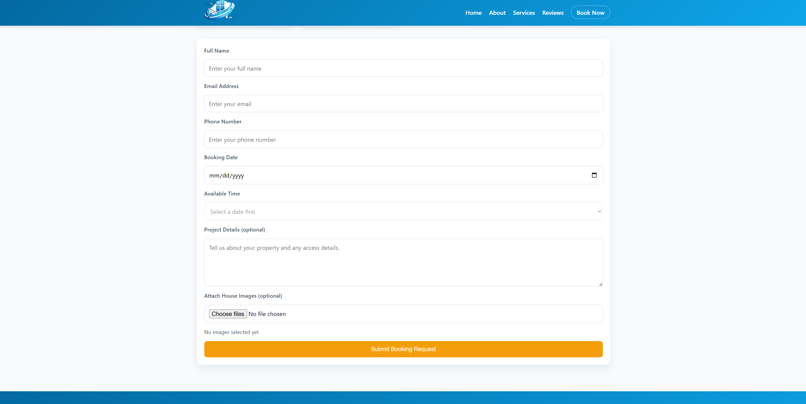
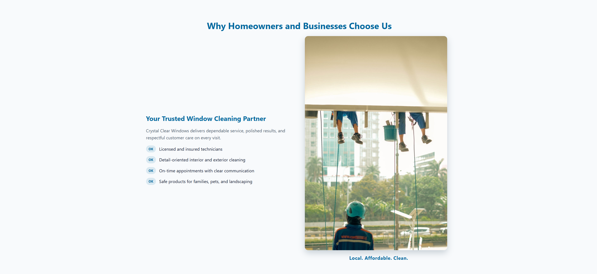

# 🪟 Crystal Clear Windows
 🪟 Crystal Clear Windows

A modern, responsive business website built to promote and manage bookings for a local window cleaning service in Ottawa.

---

## 📌 Overview

**Crystal Clear Windows** is a professional website designed to showcase window cleaning services, attract local clients, and streamline the booking process. The project focuses on simplicity, performance, and conversion optimization.

---

## 🎯 Purpose

The main goals of this project are:

- Generate leads for a local window cleaning business
- Provide a smooth and user-friendly booking experience
- Build a strong online presence with a clean and modern UI
- Integrate marketing tools (Google Ads, tracking, etc.)
- Serve as a real-world portfolio project for web development

---

## 🛠️ How It Was Built

This project was developed from scratch using a combination of modern web development tools and iterative design improvements.

- Planned structure and user flow (landing → services → booking)
- Designed UI/UX with a focus on conversions
- Built reusable components for scalability
- Continuously improved based on testing and real-world usage
- Integrated third-party services like EmailJS for form handling
- Deployed and tested live using Netlify

---

A production-ready business website built for a local window cleaning service in Ottawa, focused on lead generation, conversion optimization, and real-world usage.

---

## 🌐 Live Website

https://resplendent-melba-db37ed.netlify.app/

---

## 📊 Real Business Impact

This is not a demo project — it is actively used for a real business.

- Designed to support Google Ads campaigns
- Captures customer leads via booking form (EmailJS)
- Built with a conversion-first approach
- Structured to scale into a full booking platform

---

## 🎯 Problem → Solution

### Problem
- No online presence
- Difficult booking process
- No structured lead system

### Solution
- Built a fast, modern website
- Created simple booking flow
- Integrated email-based lead capture
- Optimized UI for conversions

---

## 🧠 System Architecture

User → React Frontend → Booking Form → EmailJS → Email Lead

---

## 🛠️ Tech Stack

Frontend:
- React.js
- Vite
- JavaScript (ES6+)
- HTML5

Styling:
- Custom CSS
- Mobile-first responsive design

Integrations:
- EmailJS
- Google Ads
- Google Tag (gtag.js)

Deployment:
- Netlify

Version Control:
- Git & GitHub

---

## 🚀 Features

- Fully responsive design
- Dynamic service selection
- Email-based booking system
- Fast performance using Vite
- Conversion-focused UI
- Smooth scrolling navigation

---

## 📸 Screenshots

### 🏠 Homepage

### 🧹 Services Section

### 🧾 Booking Form

### ℹ️ About Page

---

## 📈 Marketing & Tracking

- Google Ads landing optimization
- Conversion tracking with gtag.js
- Lead generation-focused design

---

## ⚡ Performance

- Lightweight build
- Optimized assets
- Clean structure

---

## 🔮 Future Improvements

- Backend (Node.js / Firebase)
- Database integration
- Admin dashboard
- Payment integration (Stripe)
- SEO improvements
- Reviews system

---

## 💼 Project Value

- Real-world business solution
- Revenue-focused development
- Marketing + engineering integration
- Strong UX understanding

---

## 👨‍💻 Author

Javed Alimzai  
Front-End Developer  
Ottawa, Canada

---

## 📄 License

Private project — all rights reserved.
